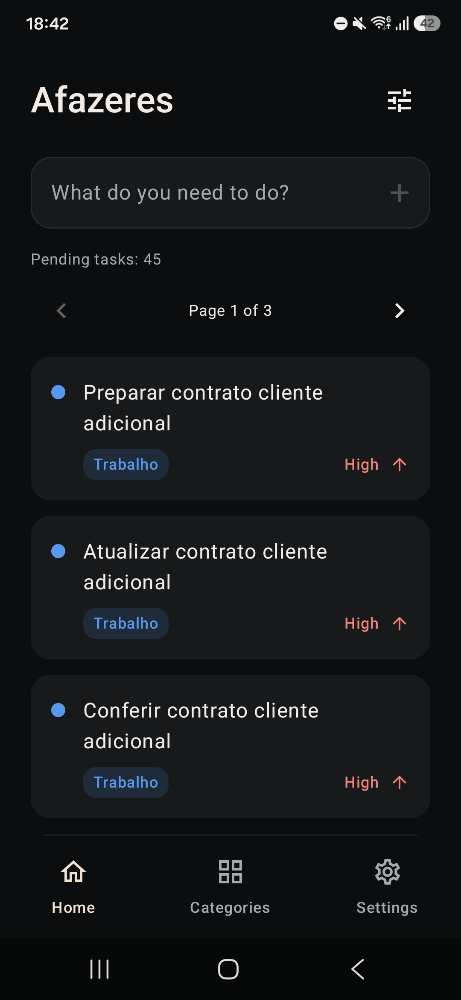
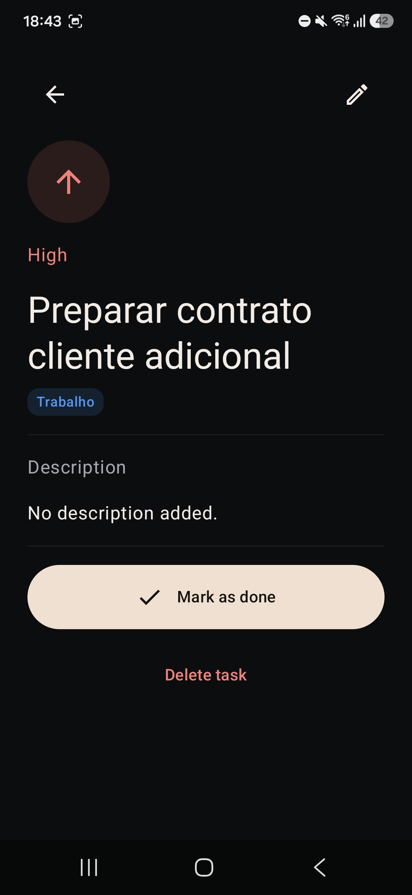
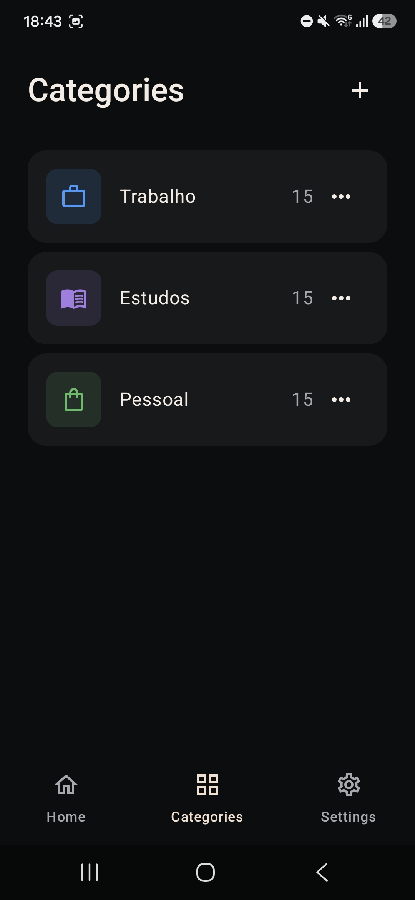
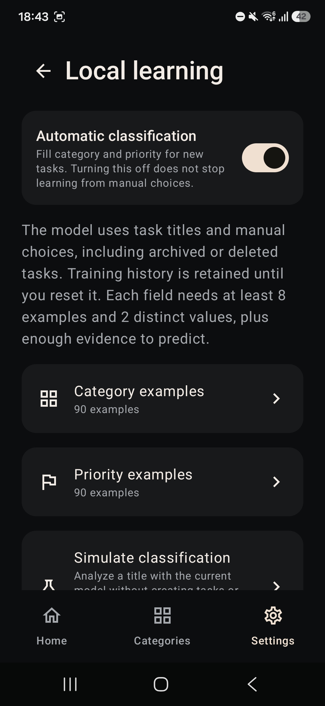

# Afazeres

Aplicativo Android para registrar seus afazeres e organizar o que precisa ser feito em um só lugar.

O Afazeres permite anotar uma tarefa diretamente na tela inicial e adicionar os detalhes depois. Descrição, categoria e prioridade são opcionais. Os afazeres de maior prioridade aparecem primeiro, ajudando a escolher por onde começar, sem precisar definir datas de entrega.

[Baixar a versão mais recente](https://github.com/dhianapereira/afazeres/releases/latest)

## O app por dentro

<p align="center">
  
  
  
  
</p>

## Funcionalidades

- Cadastro rápido de afazeres pelo campo da tela inicial, com envio pelo botão + ou pelo teclado.
- Edição de afazeres em página própria, com título obrigatório e status pendente ou concluído.
- Exclusão, conclusão e reabertura de afazeres.
- Descrição, categoria e prioridade opcionais.
- Categoria e prioridade automáticas com aprendizado local por Naive Bayes, a partir das escolhas confirmadas pelo usuário.
- Auditoria do aprendizado com exemplos por valor, simulação de títulos, controle do preenchimento e reset independente de categoria e prioridade.
- Ordenação por prioridade: alta, média, baixa e sem prioridade.
- Filtros combinados por prioridade e categoria, com contagem de tarefas que acompanha os filtros.
- Listas paginadas, com até 20 itens por página.
- Arquivamento automático ao concluir, com acesso aos arquivados pelas configurações e opção de reabrir.
- Seleção múltipla ao segurar um afazer nas listas, com ações para concluir, desarquivar ou excluir os selecionados. Selecionar e desmarcar todos afeta a página atual e preserva as escolhas nas outras páginas.
- Deslize da direita para a esquerda para concluir (ou desarquivar nos arquivados) e da esquerda para a direita para abrir a confirmação de exclusão. Gestos ficam desativados durante a seleção múltipla.
- Criação, edição, visualização e exclusão de categorias com nome, cor principal e ícone independentes.
- Cores personalizadas com prévia, paleta, controles de cor e código hexadecimal.
- Exclusão de categorias bloqueada enquanto houver afazeres vinculados, inclusive arquivados.
- Temas claro, escuro ou definido pelo sistema.
- Interface em português e inglês.
- Exportação e restauração dos afazeres, categorias e histórico de treinamento por arquivos JSON.
- Configurações com preferências, dados e backup, aprendizado local, informações legais e sobre o app. Política de privacidade e termos abrem no navegador.
- Funcionamento inteiramente offline, sem conta ou servidor externo.

## Privacidade

Os afazeres, categorias e preferências ficam armazenados localmente no dispositivo. O Afazeres não possui acesso à internet, não exibe anúncios e não utiliza serviços de análise ou rastreamento.

Os arquivos exportados são salvos no destino escolhido pela pessoa. A restauração substitui os afazeres, categorias e histórico de treinamento atuais após confirmação, mantendo as preferências de tema, idioma e preenchimento automático. Backups JSON não são criptografados pelo app.

## Tecnologias

- Kotlin e Jetpack Compose.
- Material 3.
- Room para persistência dos dados.
- DataStore para preferências.
- AppCompat para seleção de idioma.
- Coroutines e Flow.
- Arquitetura MVVM.

## Como executar

### Pré-requisitos

- Android Studio com JDK 21 para o daemon Gradle.
- Android SDK 37 instalado.
- Emulador ou dispositivo com Android API 26 ou superior.

### Android Studio

1. Abra a raiz do projeto no Android Studio.
2. Aguarde a sincronização do Gradle.
3. Selecione o módulo `app` e um dispositivo ou emulador.
4. Clique em **Run**.

O Android Studio cria o `local.properties` automaticamente com o caminho do SDK local.

### Terminal

Use o Gradle Wrapper incluído no projeto:

```bash
# Gerar o APK de debug
./gradlew assembleDebug

# Instalar em um dispositivo conectado
./gradlew installDebug

# Executar os testes unitários
./gradlew testDebugUnitTest

# Executar o Android Lint
./gradlew lintDebug

# Executar os testes de banco e migração em um dispositivo conectado
./gradlew connectedDebugAndroidTest
```

No Windows, substitua `./gradlew` por `gradlew.bat`.

## Estrutura do projeto

O projeto utiliza MVVM e organiza persistência e interface por responsabilidade. Os caminhos abaixo são relativos a `app/src/main/java/io/github/dhianapereira/afazeres/`:

- `AfazeresApplication.kt`: inicialização do banco, repositório e preferências.
- `MainActivity.kt`: entrada do app, configuração de idioma e integração com o tema.
- `data/Database.kt`: entidades, DAO, repositório e migrações do banco Room.
- `data/Backup.kt`: exportação, validação e leitura dos backups em JSON.
- `data/Preferences.kt`: preferências persistidas com DataStore.
- `ui/AfazeresViewModel.kt`: estado da interface e coordenação das operações de dados.
- `ui/AfazeresApp.kt`: navegação, afazeres, categorias, detalhes e formulários.
- `ui/TaskList.kt`: paginação, seleção múltipla e gestos das listas de tarefas.
- `ui/LearningScreen.kt`: auditoria, simulação e reset do aprendizado.
- `model/nlp/`: tokenização, classificação Naive Bayes e exemplos de treinamento.
- `ui/CategoryEditor.kt`: formulários de categoria, seleção de cores e ícones.
- `model/CategoryAppearance.kt`: catálogo de ícones e validação de cores.
- `ui/SettingsScreen.kt`: preferências, dados e backup, informações legais e sobre o app.
- `ui/theme/`: cores, formas e temas do Jetpack Compose.

As traduções ficam em `app/src/main/res/values/` e `app/src/main/res/values-en/`. Os schemas do Room ficam em `app/schemas/`.

## Releases

A preparação da assinatura, o versionamento e a geração dos artefatos estão descritos na [documentação do processo de release](./docs/RELEASE.md).

## Aprendizado local

O app começa sem exemplos de treinamento. Com o uso, aprende separadamente a categoria e a prioridade a partir dos títulos e das escolhas manuais. Previsões automáticas não são usadas como exemplos até serem confirmadas. Quando não há evidência suficiente, os campos continuam sem preenchimento.

Ao excluir tarefas, o modelo pode preservar contagens de palavras, sem copiar o título original. A opção de excluir e esquecer também remove essa contribuição. A auditoria agrupa os exemplos em seções recolhíveis e paginadas. Tarefas existentes, inclusive arquivadas, mantêm o título visível; tarefas removidas aparecem apenas na contagem. As contagens de palavras ainda revelam vocabulário e não são anonimização.

Os dados permanecem no dispositivo. Consulte [como funciona o aprendizado](./docs/LEARNING.md) para conhecer os critérios, as limitações e o comportamento do backup.

## Licença

O código-fonte está licenciado sob a [Licença MIT](./LICENSE).

O logotipo, os ícones, as capturas de tela e os elementos de identidade visual não estão cobertos pela Licença MIT e permanecem sob a condição de Todos os direitos reservados.
